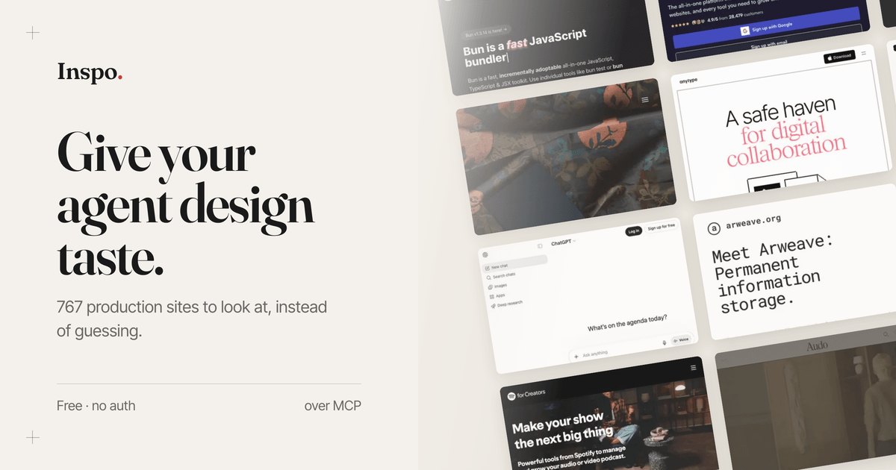
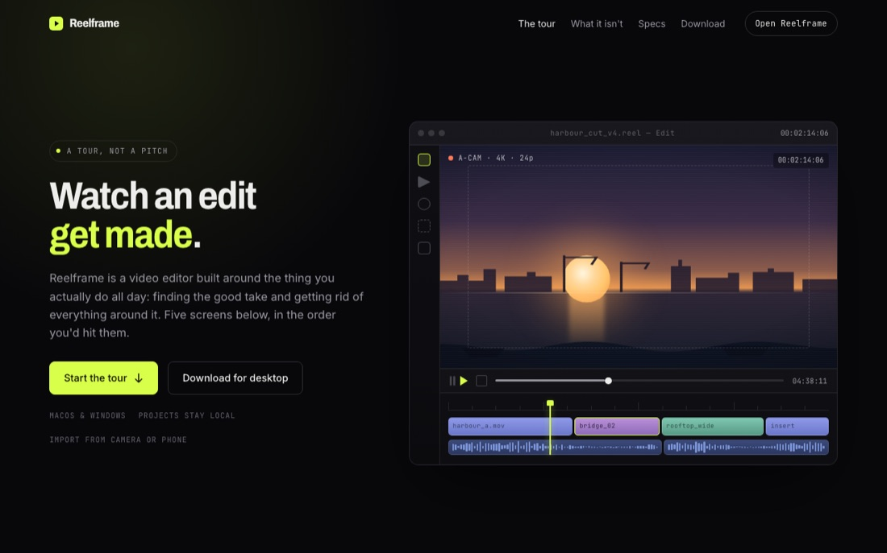
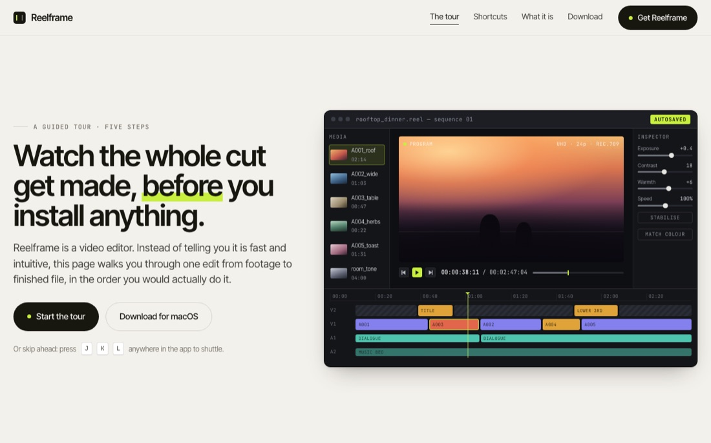

  

<h1 align="center">Inspo</h1>

Real production websites your coding agent can study, over MCP, before it writes UI. <a href="https://inspomcp.dev">inspomcp.dev</a>

## With and without

Same brief, same model, no design skill on either run. The only difference: the page on the right was built with Inspo MCP on the session.

  
  

That gap is the product. Agents have tools but not taste, and the open web already holds every reference they need: Inspo assembles, tags, and addresses it.

## What's inside

- **2,141 captures across 767 real sites**, desktop and mobile pairs, with traced palettes, real fonts, detected tech, and a fold-by-fold autopsy on every screen.
- **68 canonical reference components** (heroes, pricing, footers, navs, and more), each demonstrating one named macrostructure, with copy-pasteable JSX.
- **A DESIGN.md for every site**, extracted from its DOM: semantic palette roles, type ramp, spacing scale, CSS variables, container width.

Sixteen tools expose all of it; `recommend(brief)` composes most of them into one call. The full tool table lives in [apps/mcp/README.md](apps/mcp/README.md).

## Tech stack

- TypeScript MCP server with two transports: stdio via npm, and Streamable HTTP served by the site's own Vercel deployment. No database at query time; the catalogue ships as a static seed.
- Next.js 16 + Tailwind v4 gallery: the archive browser and the curator dashboard.
- Playwright capture worker: desktop and mobile shots, palette, type ramp and CSS variable extraction, tag and autopsy passes via Together AI.
- Together AI embeddings behind semantic search and `find_similar`.
- A smoke harness that boots the server in-process and calls every tool.

## Cloning & running

1. One command, any client: `npx -y inspo-mcp install` (detects Claude Code, Cursor, Codex, VS Code, Windsurf, Zed, Claude Desktop and writes the config; `--dry-run` shows the plan)
2. Or point a client at the hosted endpoint yourself: `claude mcp add --transport http inspo https://inspomcp.dev/api/mcp`
3. Or clone: `git clone https://github.com/Nutlope/inspo.git && cd inspo && pnpm install`
4. Gallery: `pnpm dev`, then open `localhost:3737`
5. Dev loop: `pnpm --filter @inspo/mcp test`

Per-client snippets (Cursor, Windsurf, Zed, Claude Desktop) are on [the MCP page](https://inspomcp.dev/mcp); the self-host runbook is [DEPLOY.md](DEPLOY.md).

## Roadmap

- [ ] show the desktop and mobile capture side by side on every screen page
- [ ] backfill component crops so `find_components` returns a crop for every hit
- [ ] paginate the list tools instead of capping them
- [ ] re-shoot the mobile set at retina scale
- Accounts and paywalls are skipped on purpose: the archive is more useful free. Self-hosters who want gating can flip `ENFORCE_AUTH=1`.

Want a site in the archive? Append it to [apps/worker/src/seed-urls.ts](apps/worker/src/seed-urls.ts) and open a PR. The bar: does it make the archive better for someone building a website?

## Security

Every tool is read-only. The one path that touches the outside world - `get_design_system(live:true)`, which supplements thin captured tokens from the screen's own source - passes each URL and redirect through an SSRF guard: public named hosts only, ports 80 and 443, byte-capped body, no JS execution. The hosted endpoint records per-tool counters only, never IPs or query text.

MIT, copyright Together AI and contributors. The screenshots remain the work of their designers: every screen credits and links its source, and takedowns are honoured at [/dmca](https://inspomcp.dev/dmca).
